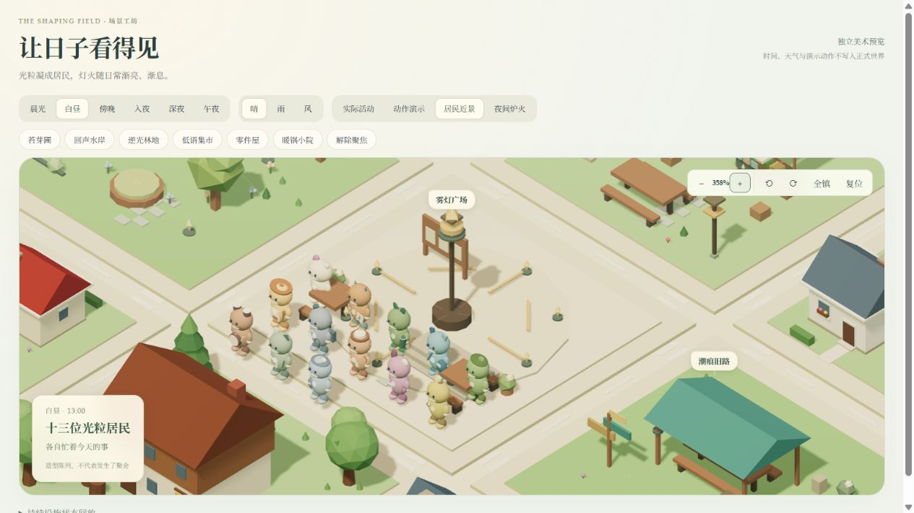
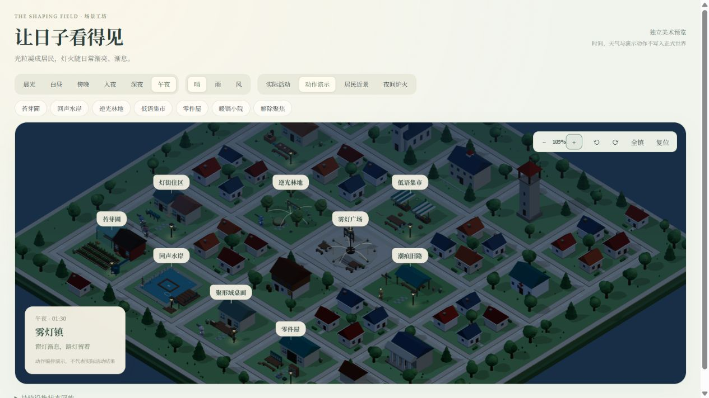

# DeskBot / 聚形域软件端

这是《聚形域》桌宠实验装置的软件工作区。当前目标不是做一个通用聊天产品，而是跑通并记录以下可审计链路：

```text
多源输入
  -> Node 持续世界与角色状态
  -> DeepSeek 对话与有限目标选择
  -> 文字 / 表情 / TTS 表达意图
  -> Web 与 ESP-VoCat 客户端
```

## 目录

- `apps/deskbot-service`：唯一在线状态源、SQLite 持久化、世界逻辑、LLM 编排、天气连接器和设备桥。
- `apps/deskbot-web`：研究与体验界面，只读取和调用服务端 API，不保存第二份世界状态。
- `apps/jev-town-client`：基于 CeciliaW888/jev-town 的 3D 世界体验客户端；读取世界地图、场景与实际任务，表现聚形域的光粒居民和持续生活，并调用服务端核验的生活互动。
- `voice-sidecar`：无状态 ASR/TTS 边界；当前基线不代表真实中文模型性能。
- `research`：研究协议、实验设计与接口说明。
- `tmp`：源码审阅副本、下载和临时产物，不进入 Git。

角色当前阶段名为“喵呜”。“聚形域”是它的持续世界背景，不是每句话都必须使用的修辞。用户输入可以影响角色方向，但不能用一句话直接改写角色、外壳或世界事实。

## 当前执行基线

- **居民长期职业项目（2026-10-05）**：苔团的浮圃、扣扣的小泵和锅粒的叶芽汤开始通过真实任务持续推进。备料、制作、携带、不同居民的实际检查或试吃，以及 6/12 小时观察门槛都有持久记录；缺料、暂停、取消和失败保留既成阶段。验收成果能继续生长收获、缩短取水时间或按配方复做，地图和居民详情显示同一份状态。见 [项目规则与边界](research/world/resident-projects-v1.md) 和 [验收记录](research/milestones/companion-world-resident-projects.md)。其余九名居民的私人项目仍是作者愿望。
- **持续生活补给循环（2026-10-05）**：水岸泉眼有有限原水与缓慢补充；角色可以实际出行、汲水净滤、携带并补给厨房/苗圃。收获的一部分能制种并存回育苗架，收获和餐食可进入共用库存。新增活动仍使用真实耗时、预留材料、失败退款与重启恢复。见 [补给循环验收](research/milestones/companion-world-supply-cycle.md)；这不是完整经济，也不保证当前单块苗床足够供养全部居民。
- **聚形域视觉更新（2026-10-05）**：保留低多边形小镇，新增喵呜与十二位居民的光粒首批造型、任务驱动动作、设施细节、连续昼夜与渐息灯火；生活侧栏整理为清楚的当前活动、居民近况、约定与记忆。见 [图文说明与预览边界](documentation/shaping-field-visual-life.md)，独立美术预览为 `/scene-review.html`。
- 第一至第六步已完成基本世界合同、现实 1:1 时钟、分层地图、实际设施、天气表现与有限资源。十三名角色共用规则生活循环；邀请、协作、交换、赴约与关系后果使用真实事务记录。见 [第六步验收](research/milestones/companion-world-step6.md) 与 [社会生活规则](research/world/social-life-v1.md)。
- 第七步已接入现实输入折射：上海天气、对话和有限生活建议影响下一次空闲选择，保留出处、暂缓理由与实际任务引用。本地已启用 DeepSeek Flash 对话、NASA Science 新闻与上海区域空气质量。其他 agent 等待真实来源，设备联调仍属第九步。见 [第七步验收](research/milestones/companion-world-step7.md)、[输入折射规则](research/world/input-refraction-v1.md) 与 [外界来源配置](research/milestones/external-input-configuration.md)。独立专项为 `/life-review.html?sample=inputs`。
- 第八步已接入三种长期记忆、关系沉淀、可逆兴趣积累与 DeepSeek 空闲目标选择。需要、任务、路线、材料和实际结果仍由世界核验；模型解释是意图，不是已经完成的经历。私人对话记忆留在本地，自动选择只引用有限镇内记录与公开消息。见 [第八步验收](research/milestones/companion-world-step8.md)；独立七日回放为 `/life-review.html?sample=memory`，不能代替正式世界真实经过七天。
- 首批造型与场景效果由客户端创作。各光域的自动形态生成、声音演化与换壳流程尚未全部接入，后续按 [当前路线图](research/development-roadmap-v0.4.md) 推进。





这两张图来自只读美术预览。实际生活界面、傍晚苗圃、夜间工作的照明例外及全部截图说明见 [聚形域：让持续生活看得见](documentation/shaping-field-visual-life.md)。预览中的时间、天气和编排动作不写入正式世界。

- 工程架构与交接索引：[`documentation/architecture.md`](documentation/architecture.md)
- 伴生世界居民重设计：[`research/npcs/resident-life-design-v1.md`](research/npcs/resident-life-design-v1.md)
- 地图内容目录：[`world-content/companion-world/map.v1.json`](world-content/companion-world/map.v1.json)；2D 与 3D 都读取 `GET /api/world/map`，内部区域与物件可展开查看。
- 角色与世界决策记录：[`research/聚形域-角色与世界决策记录_2026-09-09.md`](research/聚形域-角色与世界决策记录_2026-09-09.md)
- 喵呜角色验收：[`research/miaowu-expression-acceptance-v0.1.md`](research/miaowu-expression-acceptance-v0.1.md)
- 喵呜角色表演：[`research/miaowu-roleplay-bible-v0.1.md`](research/miaowu-roleplay-bible-v0.1.md)
- 喵呜 Soul 人格基线：[`research/soul/miaowu-soul-v0.1.md`](research/soul/miaowu-soul-v0.1.md)
- GitHub P1 里程碑：[`research/milestones/software-baseline-p1.md`](research/milestones/software-baseline-p1.md)
- P2 奇幻吸引里程碑：[`research/milestones/p2-fantasy-pull-v0.1.md`](research/milestones/p2-fantasy-pull-v0.1.md)
- 服务与固件接口：[`research/protocol/interaction-contract-v0.1.md`](research/protocol/interaction-contract-v0.1.md)

`research/development-roadmap-v0.1.md` 至 `research/development-roadmap-v0.3.md` 是历史计划及实现记录，不再作为当前排期依据。第一至第八步的资料继续保留。角色提示词或状态结构变更只有在自动测试和真实模型人工验收都通过后，才算完成。

## 首次配置

需要 Node.js 24 或更高版本；只有运行 voice-sidecar 测试或启动 sidecar 时才需要 Python 3.10+。

从公开仓库 clone 后，在仓库根目录创建本机配置副本：

```powershell
Copy-Item config\llm_config.example.json config\llm_config.json
notepad config\llm_config.json
```

只在 `config\llm_config.json` 填写自己的 DeepSeek key。真实配置文件已被 Git 忽略，不能提交。

需要和风天气时再创建：

```powershell
Copy-Item config\weather.env.example config\weather.env
notepad config\weather.env
```

将 `DESKBOT_WEATHER_URL` 的 `YOUR_API_HOST` 换成和风控制台提供的 API Host，并把 token 填入本机文件。天气文件只允许 `DESKBOT_WEATHER_*` 变量，启动时通过 `-WeatherEnvFile` 显式加载。配置字段、优先级和 v7/v1 选择见 [`config/README.md`](config/README.md) 与 [`documentation/variables.md`](documentation/variables.md)。

启动前不需要设置 `setx`，也不要把 key 放进网页、事件 JSON、命令行 URL 或日志。`scripts/start-local.ps1` 优先读取仓库内 `config\llm_config.json`；仅为兼容当前工作站，才回退到 `DeskBotClaude\foundry-bench\llm_config.json`。公开 clone 不应依赖这个旧路径。

## 本地运行

从仓库根目录启动服务、研究页面与 3D 世界客户端：

```powershell
.\scripts\start-local.ps1 -StartWeb -StartWorld
```

生活世界：<http://127.0.0.1:5173/?mode=deskbot&deskbotUrl=http://127.0.0.1:4311>。研究界面：<http://127.0.0.1:4322/>。Jev Town 接入来源、授权范围和发布清单见 [接入说明](documentation/jev-town-adoption.md)。

脚本优先读取本地 `config\llm_config.json`，默认加载已有的 `config\weather.local.env`；新闻和区域空气质量连接器默认开启。上海 Open-Meteo 天气是当前工作站配置，公开 clone 需自行配置城市。配置方法见 [本地配置](config/README.md)。可显式指定天气文件：

```powershell
.\scripts\start-local.ps1 -StartWeb -StartWorld -WeatherEnvFile (Resolve-Path config\weather.env)
```

启动脚本检查 `4311/4322/5173` 端口与健康状态；已有端口占用会直接失败。`GET /health` 仅证明服务就绪，天气与模型是否接通需查看相应连接器状态。数据库中的旧观测不能代替当前有效天气。若聊天返回 `llm_transport_error`，先检查本机网络、TLS 和代理配置。

独立预览与规则回放：

- `/scene-review.html`：昼夜、风雨、居民近景和动作编排；只读，不写入正式世界。
- `/life-review.html`：三日生活与协作、延期专项。
- `/life-review.html?sample=inputs`：现实输入折射专项。
- `/life-review.html?sample=memory`：七日记忆与兴趣积累专项，使用标注的测试模型。

停止本次本地服务：

```powershell
.\scripts\stop-local.ps1
```

## 测试与公开打包

在提交或打包前，从仓库根目录执行：

```powershell
Set-Location apps\deskbot-service
npm.cmd test
Set-Location ..\..\voice-sidecar
python -m unittest discover -s tests -v
Set-Location ..
git diff --check
git check-ignore -v config\llm_config.json config\weather.env apps\deskbot-service\data\deskbot.sqlite
```

生成公开源码包（不包含 `.git`、`tmp`、依赖、SQLite/WAL、日志、音频、模型、真实配置和 `dist`）：

```powershell
.\scripts\package-source.ps1
```

默认输出到 `dist\DeskBot-source-<UTC 时间>.zip`。可用 `-OutputDirectory` 和 `-ArchiveName` 指定位置/文件名；脚本在压缩前会再次按路径规则过滤敏感和运行时文件，并输出包含文件数量和 SHA-256 的 manifest。`dist/` 本身被 Git 忽略，源码包需通过 GitHub Release 或其他制品渠道单独发布。

## GitHub 交付边界

仓库公开基线只包含可审阅源码、接口合同、研究文档、配置模板、测试和启动脚本。真实 key、SQLite、音频/模型缓存、下载的第三方源码、固件产物和本机日志不属于公开包。CI 会在涉及服务、sidecar、配置模板、文档或脚本时运行对应回归；当前 workflow 不调用 DeepSeek、QWeather 或真实硬件。

## 提交门槛

每次服务端修改至少执行：

```powershell
Set-Location 'C:\Users\Administrator\Desktop\Jeremy\DeskBot\apps\deskbot-service'
npm.cmd test
```

涉及用户体验时，还要在真实 DeepSeek 下检查任务、事实、陪伴、玩笑与边界场景。自动测试只能证明合同没有破坏，不能替代角色效果验收。

## GitHub 使用边界

建议把本工作区作为软件仓库根目录。提交 `apps`、`voice-sidecar`、`research` 和必要的非敏感接口文档；不提交 SQLite、音频、模型缓存、密钥、本地配置、下载副本或生成式硬件产物。固件由独立 agent 维护，双方只通过版本化接口合同对齐。

仓库启用分支保护后，合并条件至少包括 `DeskBot service tests` 通过、无密钥变更、接口变更附迁移说明，以及用户可见行为附人工验收记录。
