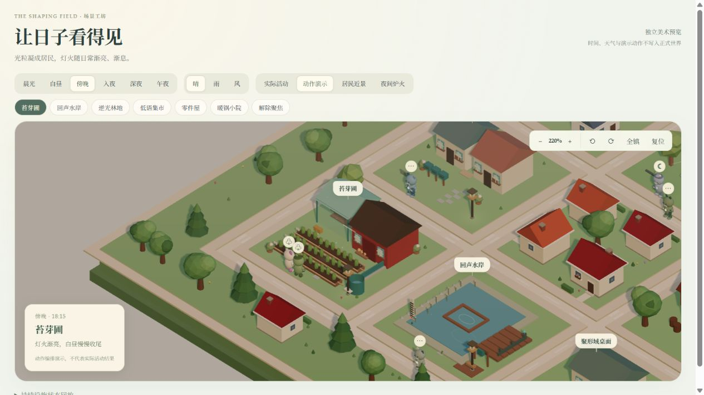
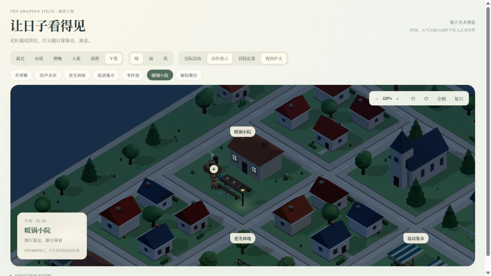
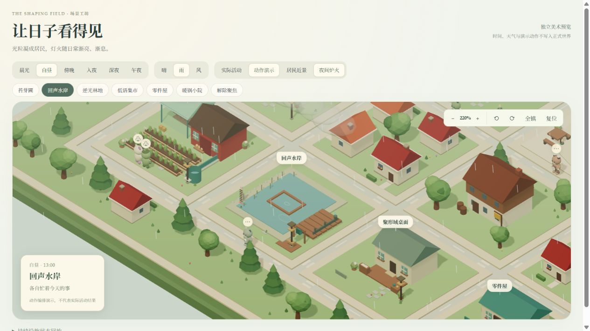
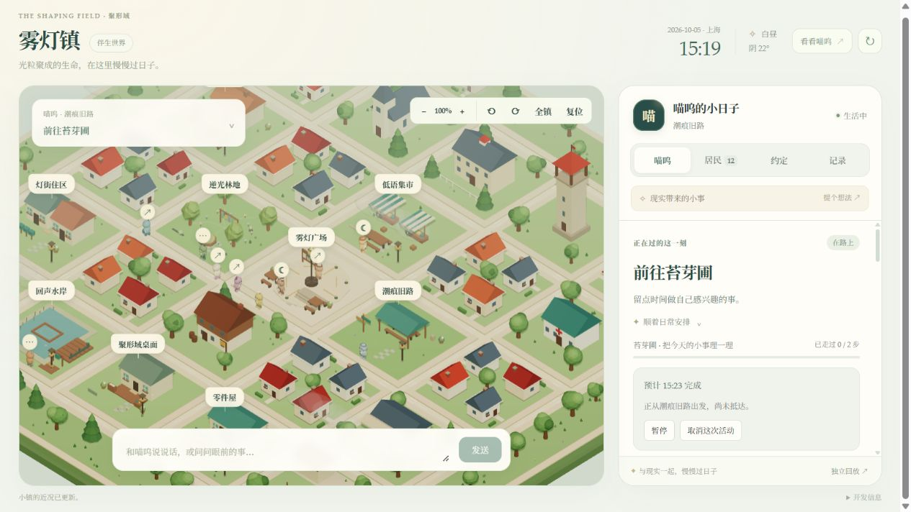

# 聚形域：让持续生活看得见

日期：2026-10-05。范围：3D 世界的视觉表达、居民造型、实际活动投影及界面整理。

聚形域是伴生于现实的奇幻空间。雾灯镇沿用低多边形、等距视角的小镇骨架，把材质、光粒、设施细节和居民动作做进场景，让生活状态能从画面中辨认出来。奇幻感来自光粒凝聚的造物与普通日常共处：照料苗床、缝补雨棚、研究一锅饭、在灯下等人。

本次保留第一至第八步的世界规则与存档；美术和动画读取这些状态，不能用一个好看的动作替代真实结果。

## 一、居民从地图人偶成为光粒造物

喵呜与十二位居民采用固定身份对应的首批造型。柔圆、短小的潮玩轮廓、独立配色、凝聚光点与随身物件共同建立辨识度：路探者带路线图，种植者带种子袋，修补者带零件盒，厨师带锅盖与围裙，裁缝有拼补纹理，记者带纸叶。

角色会呼吸、眨眼、转头，并根据实际活动切换姿态。光粒是生命材质的表达，不是新出现的世界资源，也不会触发身份变更。

上图为“居民近景”陈列：用于观察造型，不代表这些居民在正式世界里参加了一场聚会。本次提供的是已创作的首批形象；森林、海洋、星空、梦境等光域仍是可扩展设计方向，尚未接入所有形态的自动生成、自动换壳或声音演化。

## 二、设施有细节，也有真实的忙碌

苗圃增加苗床边缘、灌溉管线、种植标记、种子与育苗物件；水岸、林地、广场、零件屋、集市、小院和住家增加相应的器具、踏石、窗框、花盆、晶体和灯具。库存、苗况、湿度、积水与设施状态继续读取持久世界，而不是根据画面随机变化。

正式世界只把正在进行或暂停中的实际任务投影到场景。照料、制作、观察、社交、休息、进食和旅行有各自姿态；浇灌、缝补、修缮火花、炊煮蒸汽等效果由相应的进行中任务触发。暂停会停止作业表现；旅行尚未完成时不会显示成已经抵达。

动作循环负责表现“正在做”；完成、失败、材料消耗和关系后果仍由服务端核验。画面里的颗粒、轻摆、涟漪和蒸汽不会写入新的经历或推进世界时间。

## 三、灯火随时间与活动渐亮、渐息

昼夜使用上海时间，画面区分晨光、白昼、傍晚、入夜、深夜与午夜。天色连续变化；傍晚亮起窗灯和店招，入夜仍有温暖的日常，深夜逐渐收起店灯，午夜保留路灯与少数仍在工作的灯。

普通住家使用错峰亮灭的灯光约定，避免所有房屋同时开灯、同时熄灯。这是视觉照明规律，不能据此推断某位居民一定已回家、睡着或经营一间店铺。实际休息任务可以熄灭对应室内灯；同一地点仍有实际进行中的工作时，可以保留工作灯。

上图的“夜间炉火”是独立动作演示，用来检查午夜仍有作业时的例外。它不代表正式世界刚发生了一次夜间做饭。真实页面中的工作灯与蒸汽，需要对应的真实进行中任务。

天气保持来源与有效期。有效风雨观测影响树木、布料、水面与降水表现；观测过期时界面说明等待新天气，不伪造当前雨势或温度。

## 四、界面给日常留出清楚的位置

界面采用奶油色、深灰、柔和青绿与淡金，保留“喵呜、居民、约定、记录”四个视图。第一眼先看正在做的事、所在位置与预计完成时间；居民卡片展示具体活动，进一步展开才看到经历、来源、模型选择理由与关系记录。

“看看喵呜”只聚焦相应位置，不触发旅行。安排进度显示实际完成的步骤，不能被误认为活动已经成功。精神和食欲来自现有角色状态。三类长期记忆、私人记录隔离、输入出处、邀请与有限资源操作继续保留。

小屏幕按地图与侧栏分列呈现；控制保留键盘焦点与减少动画支持。地图承担氛围与动作，侧栏承担核对状态和互动。

## 五、正式世界与独立预览

- 正式世界入口：`/?mode=deskbot&deskbotUrl=http://127.0.0.1:4311`。读取唯一服务端状态，世界按现实 1:1 生活。
- 美术预览入口：`/scene-review.html`。时间与天气按钮只改变浏览器中的画面，不改变服务端时钟、不发起实际活动、不写入正式存档。
- “实际活动”：读取实际任务，但画面时间仍是预览时间。
- “动作演示”“居民近景”“夜间炉火”：明确标注的动作编排或造型陈列，没有正式生活结果。
- 设施状态回放：可选择独立资源样本；样本不构成正式世界的历史。
- 第一至第八步的规则、来源与验收资料继续保留在 [当前路线图](../research/development-roadmap-v0.4.md) 及其链接的阶段文档中。

本次截图中，`live-ui.jpg` 是正式页面取样；其余五张是独立美术预览。截图用于审阅本次表现，不是自动生成所有光域、真实硬件联调或完整长期成长的验收承诺。

## 验证记录

服务端 404 项测试、客户端 174 项测试、TypeScript 检查与 Vite 生产构建通过。Windows 下完整客户端回归使用 `vitest run --maxWorkers=2 --testTimeout=10000`；默认 5 秒上限曾在并行 HTTP 测试关闭连接时超时，降低并行度后全部通过，未修改断言。

浏览器检查覆盖白昼、傍晚、入夜、深夜、午夜、风雨、居民陈列、苗床照料、午夜炊煮和正式生活侧栏。390 像素宽度下修复输入栏裁切与地图按钮重复图标；恢复桌面视口后确认界面可用。截图明确区分实际页面与美术预览，浏览器控制台无错误。

修复首次渲染时设施父级坐标尚未展开导致角色偏离作业地点的问题；两个回归测试覆盖平移、旋转与缩放。地面独立接收阴影，采用高位插画光照避免傍晚贯穿地图的阴影条带。灯光使用本地时钟约定，不计算天文日出日落。

关键实现入口：`shapingFigures.ts`、`sceneLife.ts`、`sceneLifeEffects.ts`、`companionScenery.ts`、`activityProjection.ts`、`LifeSidebar.tsx` 与 `DeskBotApp.tsx`。这些是客户端表达层；世界规则和第八步长期记忆仍由服务端负责。
