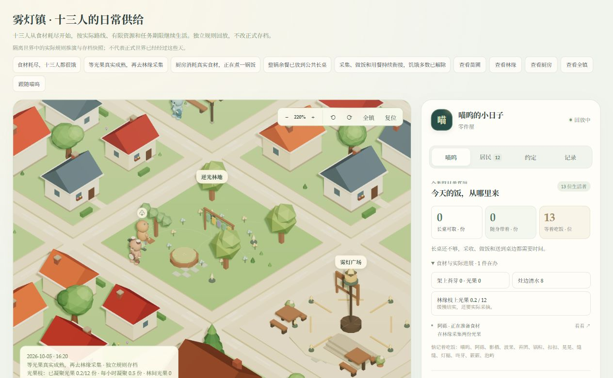
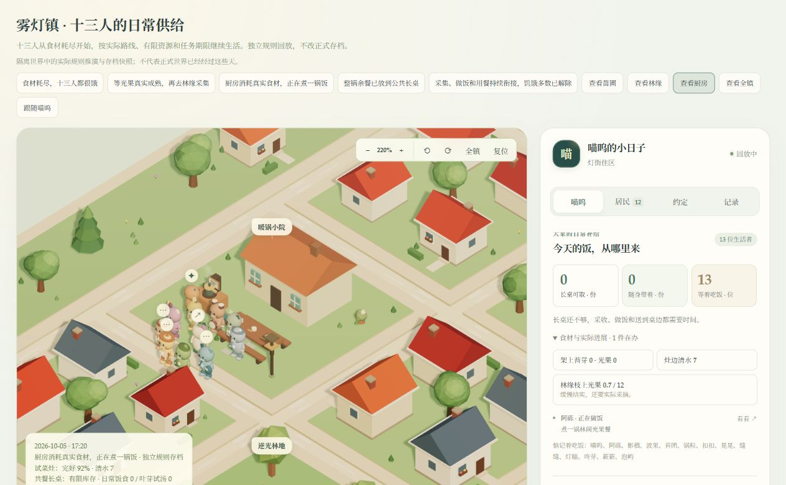
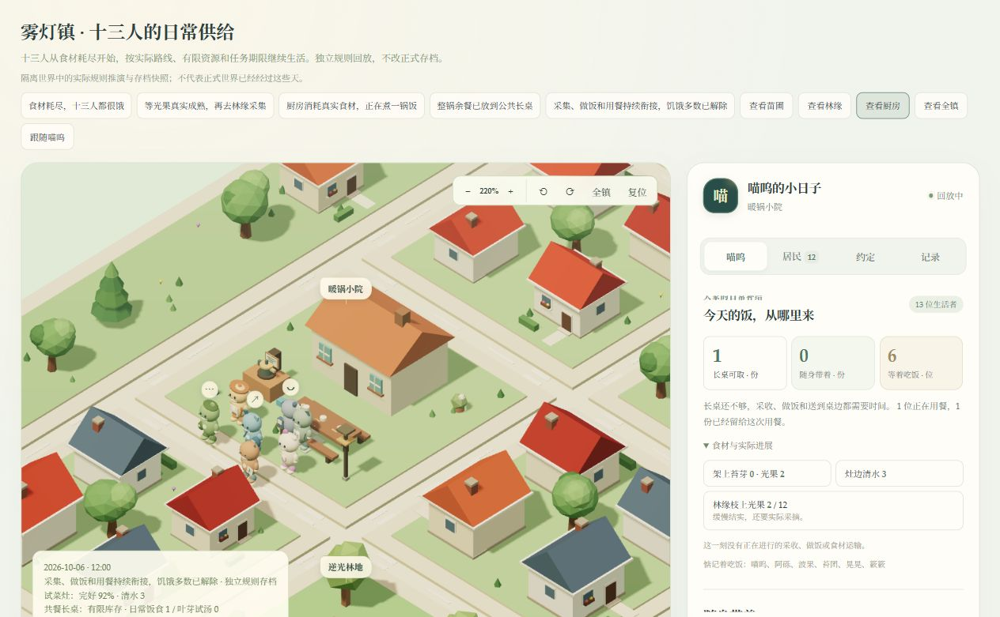

# 第 2 阶段：让十三人的生活供给继续运作

十三人的需求已接入苗床、浮圃、厨房、林缘、实际搬运和长桌。原先食物理论产能不足，又有余餐留在个人袋中的问题；现在补充有限光果来源，实际炖餐提供补充产能，整锅饭进入共用长桌，多人错开生产，邻居也能兑现一次送饭帮助。

规则见 [生活背景供给](../world/community-supply-v1.md)。共同经历沿用第 1 阶段；能力、兴趣量化和主动角色愿望继续留待后续阶段。

## 实验

所有样本使用隔离规则世界，无真实密钥、外部请求、设备或正式数据库写入。十三人保持自主生活；没有补发食材、无限商店或直接写入项目完成。

十四日加速实验每五个模拟分钟检查一次自主安排，生态与任务仍保留原耗时。所有居民都完成了重复用餐，三个项目经实际劳动和检查完成。另以十三人食欲 0.97、精力 0.5、长桌／苔芽／光果库存为 0、苗床生长 0.59 的起点测试恢复。快照按真实任务采集，未制作虚构的未来动作。

| 隔离实验 | 实际完成结果 |
| --- | --- |
| 十三人、十四日 | 205 次用餐；喵呜和锅粒各 31 次（包含共同晚饭），其余每人 13 次 |
| 第三日至第十四日 | 每小时采样，严重饥饿者最多 1 位，最终长桌留有 5 份饭 |
| 原三个居民项目 | 浮圃、小泵、汤配方均经过实际任务完成 |
| 十三人食材耗尽、72 小时 | 46 次用餐，每人 3–5 次；36／48／72 小时严重饥饿者均为 0 |

“严重饥饿”按实际食欲大于 0.9 统计，正在用餐者的食欲也要等完成才降低。供给卡中“等着吃饭”使用大于 0.6 的门槛，是日常需要而非严重饥饿。十四日末紧固件为 0，因此实验不证明无限期修缮可持续；已完成帮助的长期次数也不能由有限保留的约定历史推断。

重载、预留、退款、容量、缺料、灶具损坏、多人争用、送饭失败和共同证据都有核验。离线一天只允许此前预留的用餐完成，不产生新劳动。天气未知的十四日旱情实验验证泉眼回流，分批恢复与逐分钟推进一致。

最终验证：后端 509 项、前端 221 项测试全部通过，TypeScript 类型检查及生产构建通过。浏览器核对了采集、炖餐、存饭和恢复后的实际场景，未发现控制台警告或错误。

独立回放：[生活供给样本](http://127.0.0.1:5173/life-review.html?sample=supply)。这展示隔离存档和加速规则结果；正式世界继续真实上海时间，尚未完成现实十四日观察。

## 地图和界面

光果枝的果实数量来自枝上实际存量；采摘动作只随已开始的采集任务出现。饭碗来自长桌库存，运输篮来自居民实际随身物品，锅气来自正在进行的烹饪。侧栏区分可取饭份、携带饭份、已预留饭份与等待用餐者，并能聚焦林缘、苗圃和厨房。

## 仍待完成

实际长时运行、维护材料的可持续来源和更多职业劳动还需要观察与扩展。本阶段稳定生活背景，不宣称角色已经获得厨师能力、提出青蛙愿望或自动更换形象。下一阶段把已有共同结果连接到兴趣、能力、自评与困难原因，保持这些含义分别可追溯。
