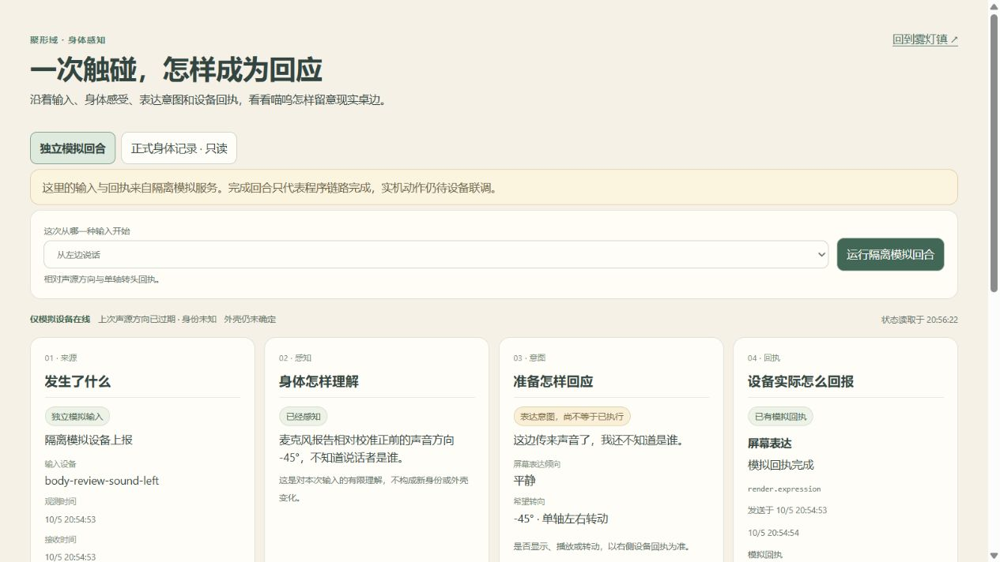
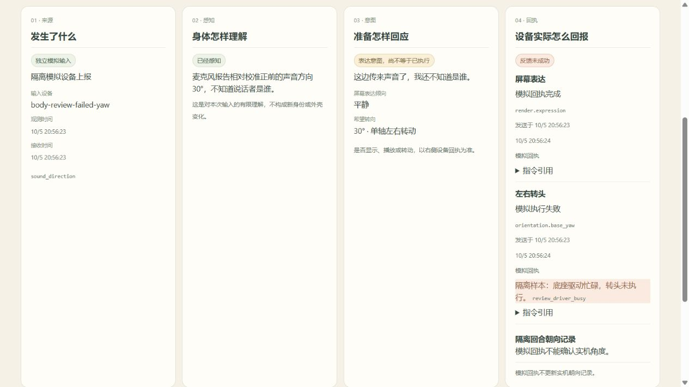

# 第九步：身体软件回合与固件接入准备

日期：2026-10-05。第九步的软件回合已实现；小智固件的实机感知、表情、电机和中文语音仍需后续适配。本轮不刷机、不打开串口、不驱动实体底座。

## 已交付

- 持久身体层 `world.body`：15 秒触摸注意、方向与坐标质量、已校准或未知外壳、动作意图、队列、发送、设备回执、失败和过期。首次安装只添加未知状态，不补写历史感知。
- 本机调试登记与能力交集：匿名 hello 不能自我取得身体权限；公开 HTTP 不能伪造身体输入/动作回执。命令由已有 outbox 唯一执行，设备按 command_id 幂等回传。
- 受限单轴 `orientation.base_yaw`：固定校准正前坐标、±60°、期限、忙碌与冷却门槛。相对当前麦阵的 DOA 不能直接用作绝对目标。声音方向不会识别人。
- 触摸进入生活选择：只在主角空闲时提供 45 秒原地观察机会；饥饿、休息、工作和约定继续优先，感知不强制改写计划或地图位置。
- 壳体识别使用服务端校准映射与目录；未知读数不猜形态，合法换壳也不重写身份与物品。
- 正式生活页的简短身体状态，以及独立 `/body-review.html`。正式记录只读；模拟写入口只存在于内存 fixture 进程。
- [小智固件结构审计](../hardware/body-bridge-audit-v0.1.md) 与六步后续适配顺序，包含本体/底座协议缺口、DOA 的 0x01/0x07 差异和没有编码器的事实。

## 独立可视验收



这张图来自独立内存服务。输入、命令和回执实际经过 WebSocket，但设备是明确的程序模拟；不会写入正式世界或证明实机转头。



失败图显示底座驱动忙碌的模拟回执。没有把发送意图当成动作成功，也没有因此产生已测得朝向。

## 自动验证

服务端全量回归 460/460、客户端回归 206/206、TypeScript 类型检查与生产构建通过。新增域、配置、HTTP/WS/SQLite 回归覆盖来源、坐标、能力、未知壳、开环与实测边界、失败、重复输入、完成后的 ACK 重传与重启；GET 不写存档。

隔离脚本的八种场景实际经过 hello → event → outbox → WS 下发 → 延迟 ACK：头部触摸、触屏、左右声源、未知壳、登记壳、转头失败、忙碌时听到声音。忙碌场景没有命令；模拟成功始终不填实际/报告硬件角度。

复现：

```powershell
node scripts/review-body-perception.mjs --smoke
node scripts/review-body-perception.mjs
# 隔离服务默认 127.0.0.1:4313；打开客户端 /body-review.html。
```

正式服务不提供 `POST /api/life/body/review`。现场调试登记模板为 `config/body_devices.example.json`，实际副本被 Git 忽略。具体协议见 [身体感知 v1](../protocol/body-perception-v1.md)。

## 仍待完成

当前设备运行小智固件，不能只替换服务器地址就连到 DeskBot。后续先固化现有修改和可恢复镜像，核验单轴坐标及唯一电机控制者，新增有界传感事件队列和可切换的 DeskBot 协议，再分步验证表情、地磁与小角度运动。

现有底座无位置编码器，正常动作回执只有设备报告的开环角度；实际角度未知。中文 ASR/TTS 未启用真实 sidecar，这轮没有假称语音识别或播报已接通。长期形态、声音风格和可制造外壳仍属第十步；硬件未闭合的部分继续在第九步记录。
