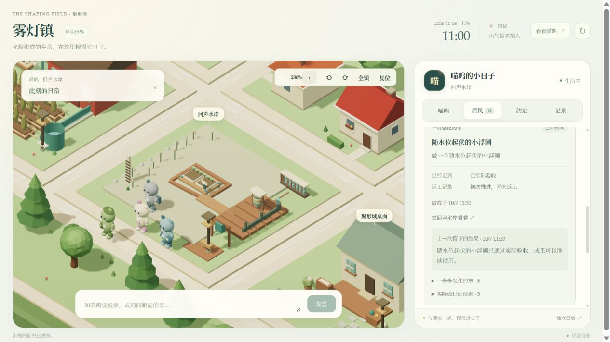
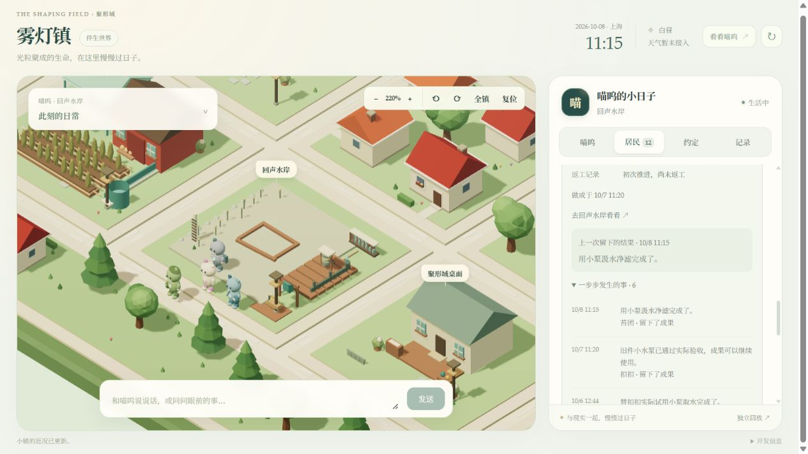
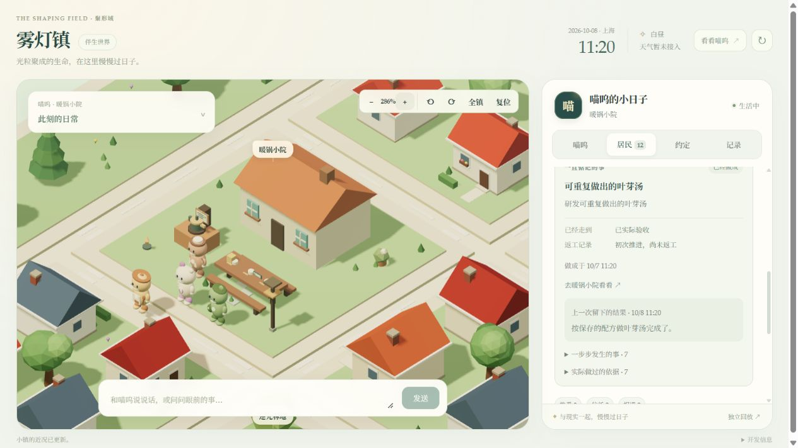

# 雾灯镇：居民长期职业项目

日期：2026-10-05。

居民原先有私人愿望，但这些文字没有对应的持续工作与可使用的成果。这一轮把苔团的小浮圃、扣扣的小水泵、锅粒的叶芽汤接入正式生活调度：想做什么、准备什么、实际做到哪一步、谁帮过忙、上次为什么失败，以及做成后如何继续使用，都从同一份持久世界状态读取。

## 本轮完成

| 居民 | 工作过程 | 留在世界里的成果 |
| --- | --- | --- |
| 苔团 | 勘查水岸，带材料搭建试种，经历至少 12 小时环境，由扣扣独立检查，再实际验收 | 六株初始试苗的浮圃；苗况随环境持续变化，成熟后收获、补种和照料 |
| 扣扣 | 清点旧件，组装样机，携带套件安装，苔团实际取水试用，安装至少 6 小时后复查验收 | 岸边的小泵；四份原水变四份清水的任务从十分钟减到五分钟，使用产生磨损，维护消耗紧固件 |
| 锅粒 | 记录配比，消耗苔芽与清水试做，带到长桌，苔团和晃晃各喝一碗反馈，隔至少 6 小时复做 | 草稿、试汤批次、两人的实际反馈、可再做的配方；两份苔芽和一份水可做三份餐食 |

20 个新活动沿用实际地点、出行、有限材料预留和任务完成事务。项目候选参加现有有限高层选择，与休息、吃饭、照料、私人兴趣和约定共同排序；DeepSeek 只能选择当下合法候选，不能改写材料、阶段或验收结果。其余九位居民的私人职业愿望仍是作者设定。

地图增加水岸浮圃与窄板、工作台小泵样机及岸边安装物、试菜灶配比纸和正式配方、长桌试汤。植株数量、生长、健康、试汤剩余份数和小泵状态来自正式对象数据。人物卡显示真实阶段、返工次数、下一道阻碍、上次结果与实际依据；地点面板显示耐久物的当前状态。旋转、出水、制作蒸汽仅在对应地点和目标上的正式运行任务中出现。

## 连续性与验证

安装只添加未完成项目和一个空试汤库存槽，不赠送成品或补造过去的经历。正式存档保持原有库存、任务和居民关系，时钟继续为上海时区的现实 1:1 时间。

本地正式部署于 2026-10-05 20:02 左右完成：服务健康，13 位角色、10 个地点，三个项目均从尚未完成的起始阶段安装；原有居民仍在休息、出行或处理手头事务。DeepSeek Flash 连通验证通过，上海天气刷新成功。公开图片仅使用下述隔离样本，未发布本地密钥、存档或用户对话。

测试覆盖材料与产出守恒、两个不同试吃者、跨日等待、暂停、取消退款、过期返工、枯苗补种、损坏维护、封路、重启和任务短期历史清理后的证据保留。规划预演只计算候选，不产生正式阶段成果。

最终服务回归 **439/439**，前端 **192/192**，TypeScript 类型检查及生产构建通过。三条从零开始的自主样本全部由原自主调度启动工作，没有注入完成阶段：水泵约 9.1 小时、浮圃 20.6 小时、叶芽汤约 7.9 小时。浮圃样本自然经历夜间休息，因此检查晚于最低 12 小时门槛。三份手动任务规则样本另跨三个测试日期核验，完成后的取水、复做、持续生长仍生效。

浏览器验收使用由正式任务规则生成的独立 SQLite 样本。图中 10 月 6–8 日为隔离测试日期，不是正式存档已经经历的日期；没有快进正式世界，也没有接入真实密钥或对话记录。完成项目至少需要再次安排实际工作，时间到达不保证居民立刻验收。

### 浮圃样本

### 水泵样本

### 配方样本

## 距离目标仍有的边界

这是一批有限作者项目的持续执行与成果系统。材料主要来自公共库存；订货、借贷、自由交换缺件和完整生产经济尚未实现。试吃评价采用批次和灶况的世界规则，并不具备真实味觉。自由发明新设施、新配方、所有职业线、自动形象及声音演变、ESP 本体传感器接入仍需后续开发。

实现规则见 [居民长期职业项目 v1](../world/resident-projects-v1.md)。
