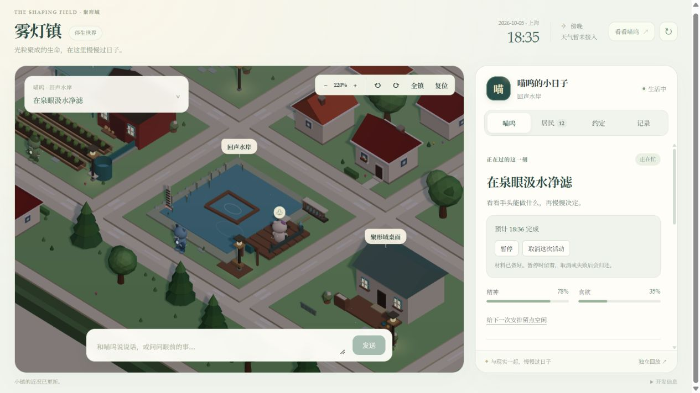
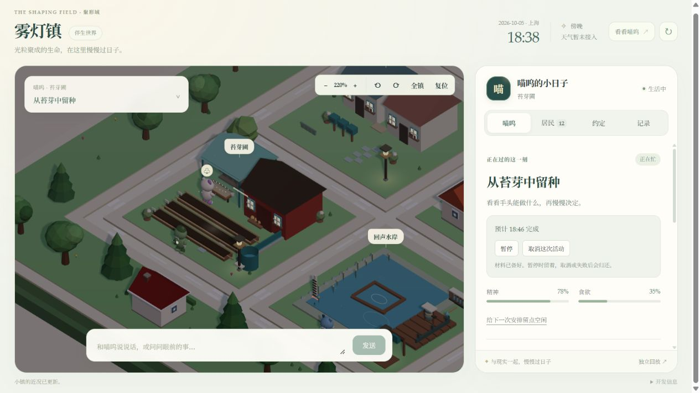

# 持续生活补给循环验收

日期：2026-10-05。交付范围为自主取水与补水、留种与播种、共享收获和餐食，以及对应场景表现。

从厨房无水、苗圃无清水、长桌无餐食、角色带两份苔芽的隔离存档出发，规则实际完成出行、十分钟取水、回程、存灶、二十分钟做饭、存餐和十分钟吃饭。样本总耗时八十三分钟，最后仍有三份随身清水和一份餐食。角色没有远程加水或跳过途中时间。

另一隔离样本在空苗床、育苗架无种子、随身两份苔芽的条件下，完成二十分钟制种、存入育苗架和十分钟播种，总耗时三十二分钟，得到十株活苗。原有苔芽实际消耗，种子没有凭空出现。

集成回归覆盖主要阶段的 SQLite 重启、同分钟重复 tick、只读 API 幂等，六小时无种无苔芽不制造作物，途中封路不伪造抵达，共享取水排他，以及设施损坏后的失败退款。资源专项另覆盖源容量、已预留容量、加法迁移与安装前不回填补给。

真实生产时钟仍为 1:1；上述分钟数来自独立模拟存档，不构成正式世界已发生的生活历史。规则与已知边界见 [补给循环规则](../world/resource-renewal-v1.md)。

验证：后端全量 419/419，前端 29 个文件共 181/181；TypeScript 类型检查和生产构建通过。雨水产生 2.8 份清水的回归同时验证整份搬运、普通补水、紧急浇水和重启后守恒。

本地于 2026-10-05 18:43（上海）完成部署。部署前 SQLite 在线备份完整性为 `ok`；旧文件已备份并按 SHA-256 核对复制。正式服务健康检查通过，DeepSeek Flash 为 `connected`，上海 Open-Meteo 天气为 `fresh`，地图保留 13 位角色、10 个地点及原有 1:1 实时时钟。正式页面已核对新增泉眼库存和 16 项生活活动，浏览器控制台无警告或错误。

以下为独立验收存档的浏览器截图，展示实际进行中的取水和留种任务，不是正式世界的历史记录。两种样本的浏览器控制台均无警告或错误。

