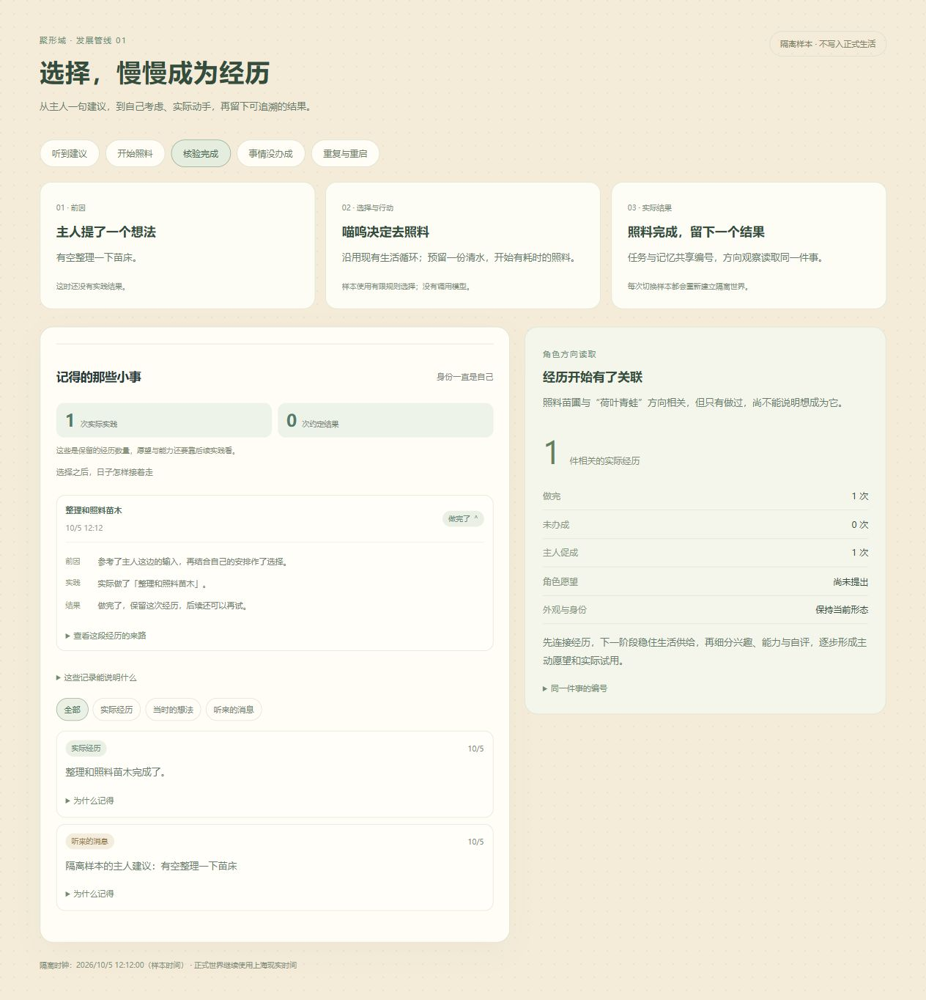
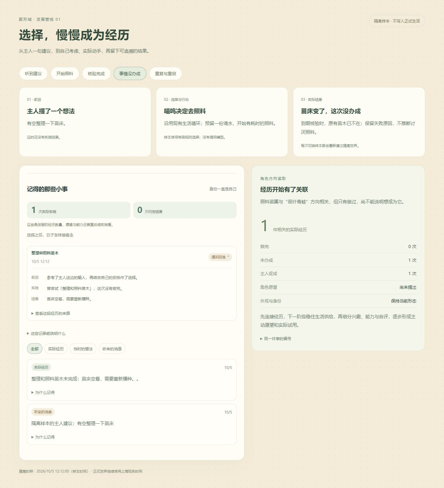

# 角色发展第 1 阶段：共同经历

2026-10-05

本阶段接通“主人建议 → 自己选择 → 实际任务 → 核验结果 → 生活记忆与角色方向读取”，原存档、兴趣数值和旧提案继续兼容。共同证据供后续兴趣、能力、主动愿望与实际试用使用。

## 实验效果

隔离样本从主人建议整理苗床开始。建议时实践结果为 0；有限生活规则结合当前状态选择照料并预留一份清水，执行时仍为 0；任务到期、资源事务核验后为 1。任务和记忆共用同一个根，荷叶青蛙方向读到 1 件相关实际经历，无需向输入队列制造一条实践消息。

失败样本在到期前移除了原有苗木，正常任务核验产生失败和 `no_effect`，保留原因，不变成讨厌照料或能力差。重复与重启样本仍为 1 个结果。项目与记忆重复视图、帮助者归属、约定关联、2048 根保留和任务裁剪另有专项验证。





两图来自独立内存世界、控制样本时钟和有限规则选择；没有修改正式生活、调用 DeepSeek 或控制硬件。正式网页中的经历来自实际存档。

## 验证与运行

服务全量 492 项、前端全量 213 项通过；后续界面合同细化 12 项专项和类型检查通过，生产构建与 smoke 通过。覆盖真实临时 SQLite 配方消耗、完成与重启，正式 HTTP 纯读和伪造实践拒绝，旧记忆启动 additive 回填。

```powershell
node scripts/review-development-evidence.mjs --smoke
node scripts/review-development-evidence.mjs
```

第二条启动独立 `127.0.0.1:4314` 服务。打开 `/development-review.html` 切换建议、执行、完成、失败、重复重启五种样本。脚本不打开正式数据库或配置。正式生活页面的“我”、居民和日记使用同一 `memory.development`，可展开前因、结果与来路。

## 边界与下一步

数据已连接，主动愿望和能力评价还没有接入。主人促成的真实实践已记录，旧兴趣 bonus 暂未改变。既有方向候选仍是关键词输入机制，旧试用仍有对话回合语义。

下一阶段按 [v0.5 路线](../development-roadmap-v0.5.md) 核算并稳定十三人的供给、消耗、分配与协作。真实 7–14 天观察继续积累，隔离样本不能替代它。
